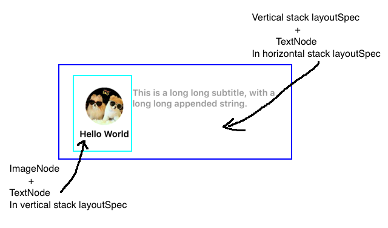
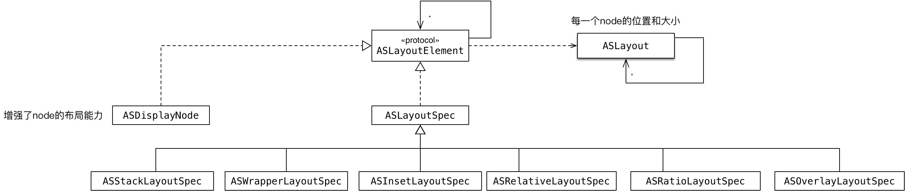
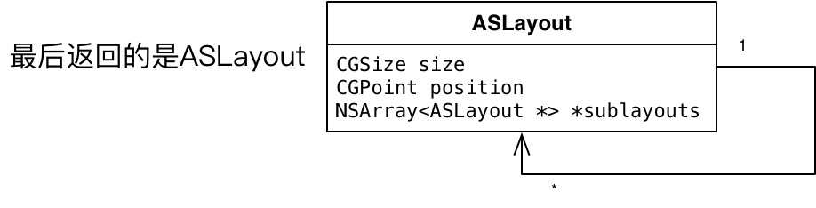
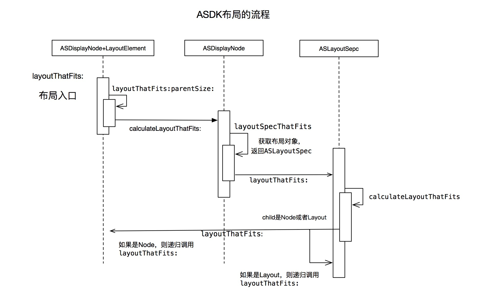

ASDK （现更名为 [Texture](http://texturegroup.org) ) 是一个构建在UIKit之上的iOS框架，官网号称能使最复杂的用户界面也能流畅和快速响应。能够重新定义一套UIKit并且能取代苹果官方的UIKit,确实是一件很令人兴奋的事情。也只有Facebook这种大公司能够折腾出这么强大的第三方库。接下来让我们来揭开ASDK神秘的面纱。
ASDK包含两个大的模块：Node的异步绘制和布局引擎。下面我们将分别从两方面深入了解其实现机制。
# Node的异步绘制
通常，我们的APP出现卡顿现象，主要原因是主线程的任务量太大，导致用户界面不能得到及时的渲染。通常阻塞主线程的任务，主要分为视图布局和文本尺寸的计算，文本、图片的绘制和渲染以及视图对象的生命周期的管理。由于单个线程在某一个时刻只能执行一项任务，不能很好地利用CPU多核的优势。因此ASDK的目标，就是尽量将不需在主线程中执行的任务分发到其他线程，使得主线程只保留一些必须在主线程中执行的任务。充分利用并发的优势来优化性能。

我们知道UIView是应用程序用户界面的基本组成部分，定义了View的行为及其显示。而UIView的显示则主要由CALayer来完成。那ASDK同样也需要一个对象来承载这些功能，那就是ASDisplayNode类。

### ASDisplayNode的异步绘制

ASDisplayNode是整个AsyncDisplayKit的基石，它是ASDK页面异步绘制的核心，充当了UIView和CALayer的功能。如图是ASDisplayNode的类层次图，可以看到常用的一些控件都是从ASDisplayNode继承而来。接下来我们重点分析下ASDisplay的工作原理。


首先我们看下官方的解释

> An `ASDisplayNode` is an abstraction over `UIView` and `CALayer` that allows you to perform calculations about a view hierarchy off the main thread, and could do rendering off the main thread as well.
	
> 大致的意思是：`ASDisplayNode`是`UIView`和`CALayer`的抽象，它能够实现不在主线程执行视图的层次计算和绘制布局

很明显`ASDisplayNode`的强大之处在于充分利用后台线程来完成复杂的布局和绘制，通常UIKit的创建、布局计算和绘制都集中在主线程，这增大了主线程的压力从而导致当APP视图过于庞大和复杂时，出现卡顿现象。
`ASDisplayNode`绘制时序图如下，我们可以看到绘制的入口是CALayer的`display`方法。我们来看下官网对display方法的解释：
> Do not call this method directly. The layer calls this method at appropriate times to update the layer’s content. If the layer has a delegate object, this method attempts to call the delegate’s  [`displayLayer:`](https://developer.apple.com/documentation/quartzcore/calayerdelegate/2097261-displaylayer?language=objc)  method, which the delegate can use to update the layer’s contents. If the delegate does not implement the  [`displayLayer:`](https://developer.apple.com/documentation/quartzcore/calayerdelegate/2097261-displaylayer?language=objc)  method, this method creates a backing store and calls the layer’s  [`drawInContext:`](https://developer.apple.com/documentation/quartzcore/calayer/1410757-drawincontext?language=objc)  method to fill that backing store with content. The new backing store replaces the previous contents of the layer.

> 大意是：`display`方法由系统调用，用来更新layer的内容，如果layer有delegate对象，那么display方法将尝试调用delegate的`displayLayer:`方法来更新layer的内容。如果delegate没有实现`displayLayer:`方法，则这个方法会创建一个backing store来保存原来的内容,然后调用layer的`drawInContext`方法来填充back store。最后以新的backing store替换layer的先前的内容达到更新layer的目的。通常UIKit中`CALayer`的`delegate`是`UIView`对象。
这也就是构成了我们平常理解的UIView与CALayer的关系，类图如下：

<center></center>

通常我们有两种方式来自定义CALayer的内容，一种直接设置CALayer的contents属性来创建寄宿图；另一种是通过实现CALayer的delegate方法，可以用于直接对CALayer进行操作，平时我们用的最多的就是UIView提供的`-drawRect:`方法，其实也是由CALayer的`drawInContext`方法调用CALayerDelegate的`drawLayer:inContext:`方法，进行调起UIView的`-drawRect:`方法。

ASDisplayKit就是利用上面两种机制来实现自定义绘制CALayer的内容。ASDisplayNode将Layer和View的关系进行了解耦，如图是三者之间的类图关系：

<center></center>
可以看到ASDisplayNode持有UIView和CALayer两种对象，这两种对象均由node自己生成并管理，并暴露给外界。

弄清楚ASDisplayNode的大致功能和结构后，接下来我们分析下node的异步绘制机制。如下是ASDisplayNode的绘制时序图：


`_ASDisplayLayer`通过重写了`CALayer`的`display`方法来自定义CALayer的寄宿图（content）属性。由上面类图可以看到`_ASDisplayLayer`与`ASDisplayNode`的关系类似于`CALayer`与`UIView`的关系。ASDisplayNode所有视图的layer的实现均采用`_ASDisplayLayer`。因此`_ASDisplayLayer`是绘制的起点。下面我们来仔细分析视图绘制的流程。

首先`_ASDisplayLayer`会将绘制的事件传递给`ASDisplayNode`,入口函数代码如下：

```Objective-C
//ASDisplayNode的异步绘制入口
- (void)displayAsyncLayer:(_ASDisplayLayer *)asyncLayer asynchronously:(BOOL)asynchronously
{
  ...
  __instanceLock__.lock();
  
  if (_hierarchyState & ASHierarchyStateRasterized) {
    __instanceLock__.unlock();
    return;
  }
  
  CALayer *layer = _layer;
  BOOL rasterizesSubtree = _flags.rasterizesSubtree;
  
  __instanceLock__.unlock();

  // for async display, capture the current displaySentinel value to bail early when the job is executed if another is
  // enqueued
  // for sync display, do not support cancellation
  
  asdisplaynode_iscancelled_block_t isCancelledBlock = nil;
  if (asynchronously) {
    uint displaySentinelValue = ++_displaySentinel;
    __weak ASDisplayNode *weakSelf = self;
    isCancelledBlock = ^BOOL{
      __strong ASDisplayNode *self = weakSelf;
      return self == nil || (displaySentinelValue != self->_displaySentinel.load());
    };
  } else {
    isCancelledBlock = ^BOOL{
      return NO;
    };
  }

  // 步骤1. 递归获取displayBlock
  asyncdisplaykit_async_transaction_operation_block_t displayBlock = [self _displayBlockWithAsynchronous:asynchronously isCancelledBlock:isCancelledBlock rasterizing:NO];
  
  if (!displayBlock) {
    return;
  }
  
  ASDisplayNodeAssert(layer, @"Expect _layer to be not nil");

  //步骤2. 绘制完成后的回调
  asyncdisplaykit_async_transaction_operation_completion_block_t completionBlock = ^(id<NSObject> value, BOOL canceled){
    ASDisplayNodeCAssertMainThread();
    if (!canceled && !isCancelledBlock()) {
      UIImage *image = (UIImage *)value;
      BOOL stretchable = (NO == UIEdgeInsetsEqualToEdgeInsets(image.capInsets, UIEdgeInsetsZero));
      if (stretchable) {
        ASDisplayNodeSetResizableContents(layer, image);
      } else {
        layer.contentsScale = self.contentsScale;
        layer.contents = (id)image.CGImage;
      }
      [self didDisplayAsyncLayer:self.asyncLayer];
      
      if (rasterizesSubtree) { //如果对子类进行了栅格化，则负责调用子类的完成显示函数
        ASDisplayNodePerformBlockOnEverySubnode(self, NO, ^(ASDisplayNode * _Nonnull node) {
          [node didDisplayAsyncLayer:node.asyncLayer];
        });
      }
    }
  };

  // Call willDisplay immediately in either case
  [self willDisplayAsyncLayer:self.asyncLayer asynchronously:asynchronously];
  
  if (rasterizesSubtree) { //提前调用子节点栅格化的即将显示函数
    ASDisplayNodePerformBlockOnEverySubnode(self, NO, ^(ASDisplayNode * _Nonnull node) {
      [node willDisplayAsyncLayer:node.asyncLayer asynchronously:asynchronously];
    });
  }
   //步骤3 调度displayBlock
    if (asynchronously) {
        //将结果的最终应用程序同步到layer的contents属性
        //首先向上遍历superlayer链，直到找到第一个layer的asyncdisplaykit_isAsyncTransactionContainer属性为YES;
        CALayer *containerLayer = layer.asyncdisplaykit_parentTransactionContainer ? : layer;
        
        //在transaction尚且不存在的情况下（例如容器外一个单独的node）,这个调用会allocate transaction，然后添加到_ASAsyncTransactionGroup
        //并且transaction在runloop的末尾会被自动提交
        _ASAsyncTransaction *transaction = containerLayer.asyncdisplaykit_asyncTransaction;
        
        // Adding this displayBlock operation to the transaction will start it IMMEDIATELY.
        // The only function of the transaction commit is to gate the calling of the completionBlock.
        [transaction addOperationWithBlock:displayBlock priority:self.drawingPriority queue:[_ASDisplayLayer displayQueue] completion:completionBlock];
    } else {
    UIImage *contents = (UIImage *)displayBlock();
    completionBlock(contents, NO);
  }
}

```
代码主要流程是：

> 1. 获取node的displayBlock,也就是负责根据node的视图层级得到需要显示的内容的绘制任务
> 2. 生成node绘制完成后的回调block
> 3. 根据`displaysAsynchronously`属性来判断是否需要异步展示，如果是异步的，则将displayBlock提交至_ASAsyncTransaction中，否则立即执行displayBlock.

我们具体看下绘制的回调Block，它接收一个UIImage类型的value参数，然后将它设置为CALayer的寄宿图。这个过程必须要在主线程中完成。但是displayBlock的执行过程是绘图操作，操作的是Core Graphics，由于 Core Graphics 方法通常都是线程安全的,这些操作以很容易的放到后台线程进行。例如：

```Objective-C
UIGraphicsBeginImageContextWithOptions(CGSize size, BOOL opaque, CGFloat scale)
UIGraphicsGetCurrentContext()
UIGraphicsGetImageFromCurrentImageContext()
UIGraphicsEndImageContext()
```

### displayBlock的创建

首先我们看下displayBlock，其类型为asyncdisplaykit_async_transaction_operation_block_t，定义如下：

```Objective-C
typedef id<NSObject> _Nullable(^asyncdisplaykit_async_transaction_operation_block_t)(void);
```
该block类型有一个可选的返回值类型，主要作用是在当前上下文中绘图Context完成绘制或者直接返回一个需要显示的Image对象。下面我们看下displayBlock的创建逻辑：

```Objective-C
- (asyncdisplaykit_async_transaction_operation_block_t)_displayBlockWithAsynchronous:(BOOL)asynchronous
                                                                    isCancelledBlock:(asdisplaynode_iscancelled_block_t)isCancelledBlock
                                                                         rasterizing:(BOOL)rasterizing
{
  ASDisplayNodeAssertMainThread();

  asyncdisplaykit_async_transaction_operation_block_t displayBlock = nil;
  ASDisplayNodeFlags flags;
  
  __instanceLock__.lock();

  flags = _flags;
  
  // We always create a graphics context, unless a -display method is used, OR if we are a subnode drawing into a rasterized parent.
  BOOL shouldCreateGraphicsContext = (flags.implementsImageDisplay == NO && rasterizing == NO);
  BOOL shouldBeginRasterizing = (rasterizing == NO && flags.rasterizesSubtree); //是否需要光栅化
  BOOL usesImageDisplay = flags.implementsImageDisplay;
  BOOL usesDrawRect = flags.implementsDrawRect; //实现了drawRect:(CGRect)bounds 
  
  if (usesImageDisplay == NO && usesDrawRect == NO && shouldBeginRasterizing == NO) {
    // Early exit before requesting more expensive properties like bounds and opaque from the layer.
    __instanceLock__.unlock();
    return nil;
  }
  
  BOOL opaque = self.opaque;
  CGRect bounds = self.bounds;
  UIColor *backgroundColor = self.backgroundColor;
  CGColorRef borderColor = self.borderColor;
  CGFloat borderWidth = self.borderWidth;
  CGFloat contentsScaleForDisplay = _contentsScaleForDisplay;
    
  __instanceLock__.unlock();

  // Capture drawParameters from delegate on main thread, if this node is displaying itself rather than recursively rasterizing.
  id drawParameters = (shouldBeginRasterizing == NO ? [self drawParameters] : nil);
  
  // Only the -display methods should be called if we can't size the graphics buffer to use.
  if (CGRectIsEmpty(bounds) && (shouldBeginRasterizing || shouldCreateGraphicsContext)) {
    return nil;
  }
  ...

  if (shouldBeginRasterizing) { //是否需要栅格化，displayBlock1生成逻辑
    // Collect displayBlocks for all descendants.
    NSMutableArray *displayBlocks = [NSMutableArray array];
    [self _recursivelyRasterizeSelfAndSublayersWithIsCancelledBlock:isCancelledBlock displayBlocks:displayBlocks];
    CHECK_CANCELLED_AND_RETURN_NIL();
    
    // If [UIColor clearColor] or another semitransparent background color is used, include alpha channel when rasterizing.
    // Unlike CALayer drawing, we include the backgroundColor as a base during rasterization.
    opaque = opaque && CGColorGetAlpha(backgroundColor.CGColor) == 1.0f;

    displayBlock = ^id{
      CHECK_CANCELLED_AND_RETURN_NIL();
      
      UIGraphicsBeginImageContextWithOptions(bounds.size, opaque, contentsScaleForDisplay);

      for (dispatch_block_t block in displayBlocks) { //循环调用block
        CHECK_CANCELLED_AND_RETURN_NIL(UIGraphicsEndImageContext());
        block();
      }
      
      UIImage *image = UIGraphicsGetImageFromCurrentImageContext();
      UIGraphicsEndImageContext();

      ASDN_DELAY_FOR_DISPLAY();
      return image;
    };
  } else {  //displayBlock2生成逻辑
    displayBlock = ^id{
      CHECK_CANCELLED_AND_RETURN_NIL();

      if (shouldCreateGraphicsContext) { //自己单独创建GraphicsContext
        UIGraphicsBeginImageContextWithOptions(bounds.size, opaque, contentsScaleForDisplay);
        CHECK_CANCELLED_AND_RETURN_NIL( UIGraphicsEndImageContext(); );
      }

      CGContextRef currentContext = UIGraphicsGetCurrentContext();
      UIImage *image = nil;
      
      // For -display methods, we don't have a context, and thus will not call the _willDisplayNodeContentWithRenderingContext or
      // _didDisplayNodeContentWithRenderingContext blocks. It's up to the implementation of -display... to do what it needs.
      [self __willDisplayNodeContentWithRenderingContext:currentContext drawParameters:drawParameters];
      //根据实现不同采用三种绘制方式
      if (usesImageDisplay) { //例如图片 If we are using a display method, we'll get an image back directly.
        image = [self.class displayWithParameters:drawParameters isCancelled:isCancelledBlock];
      } else if (usesDrawRect) { //TextNode  If we're using a draw method, this will operate on the currentContext.
        [self.class drawRect:bounds withParameters:drawParameters isCancelled:isCancelledBlock isRasterizing:rasterizing];
      }
      //绘制后的处理
      [self __didDisplayNodeContentWithRenderingContext:currentContext image:&image drawParameters:drawParameters backgroundColor:backgroundColor borderWidth:borderWidth borderColor:borderColor];
      
      if (shouldCreateGraphicsContext) {
        CHECK_CANCELLED_AND_RETURN_NIL( UIGraphicsEndImageContext(); );
        image = UIGraphicsGetImageFromCurrentImageContext();
        UIGraphicsEndImageContext();
      }

      ASDN_DELAY_FOR_DISPLAY();
      return image;
    };
  }

  return displayBlock;
}

```
这里出现了一个flags变量，这个结构体变量主要用来标记该Node的一些状态属性，以及是否重载了某些方法。在生成displayBlock之前，首先对是否需要创建Graphics Context和对Layer进行栅格化（*栅格化就是将当前Layer及其子Layer矢量图转化为bitmap(位图)，并且存储在缓存中，下次存储的时候就从缓存中读取，一般适用于变化不大的Layer*）进行了判断。如果当前Layer启用栅格化，由于这里需要对当前Layer进行绘制，因此需要创建Graphics Context,在新的环境下进行绘制。那么其子Layer均需要在当前的Graphics Context进行绘制。因此这里设置了一个变量rasterizing来标记当前Layer的父Layer是否正在进行栅格化，如果是，则不需要创建新的Graphics Context。

大家可以看到，生成displayBlock的流程根据`shouldBeginRasterizing`分成了两个分支，生成了两个Block,为了区分，这里标记为displayBlock1和displayBlock2：

1. displayBlock1： 需要启用栅格化，首先通过 
`- (void)_recursivelyRasterizeSelfAndSublayersWithIsCancelledBlock: displayBlocks:`函数递归获取子node的displayBlock,存储在displayBlocks中，然后生成displayBlock，block里面新建Graphics Context，将存储在displayBlocks依次在当前的Graphics Context中执行，完成绘制工作，随后通过`UIGraphicsGetImageFromCurrentImageContext`得到当前图形上下文内容的图像对象并返回。
2. displayBlock2： 不需要栅格化，根据当前Node的类型，分别调用类的方法进行绘制，主要分为图像类和文本类。

在启用栅格化时候，在获取子node的displayBlock时候，调用了`- (void)_recursivelyRasterizeSelfAndSublayersWithIsCancelledBlock: displayBlocks:`方法，下面我们具体看下，这方法主要做了些什么。代码如下：

```Objective-C
- (void)_recursivelyRasterizeSelfAndSublayersWithIsCancelledBlock:(asdisplaynode_iscancelled_block_t)isCancelledBlock displayBlocks:(NSMutableArray *)displayBlocks
{
  // Skip subtrees that are hidden or zero alpha.
  if (self.isHidden || self.alpha <= 0.0) {
    return;
  }
  
  __instanceLock__.lock();
  BOOL rasterizingFromAscendent = (_hierarchyState & ASHierarchyStateRasterized);
  __instanceLock__.unlock();

  // if super node is rasterizing descendants, subnodes will not have had layout calls because they don't have layers
  if (rasterizingFromAscendent) {
    [self __layout];
  }

  // Capture these outside the display block so they are retained.
  UIColor *backgroundColor = self.backgroundColor;
  CGRect bounds = self.bounds;
  CGFloat cornerRadius = self.cornerRadius;
  BOOL clipsToBounds = self.clipsToBounds;

  CGRect frame;
  
  // If this is the root container node, use a frame with a zero origin to draw into. If not, calculate the correct frame using the node's position, transform and anchorPoint.
  //如果是根容器节点，则将当前绘制的frame orgin设置为 （0，0），否则需要计算子节点在父节点的坐标
  if (self.rasterizesSubtree) {
    frame = CGRectMake(0.0f, 0.0f, bounds.size.width, bounds.size.height);
  } else {
    CGPoint position = self.position; //position是layer相对superLayer坐标空间的位置
    CGPoint anchorPoint = self.anchorPoint;
    
    // Pretty hacky since full 3D transforms aren't actually supported, but attempt to compute the transformed frame of this node so that we can composite it into approximately the right spot.
    CGAffineTransform transform = CATransform3DGetAffineTransform(self.transform);
    CGSize scaledBoundsSize = CGSizeApplyAffineTransform(bounds.size, transform);
    CGPoint origin = CGPointMake(position.x - scaledBoundsSize.width * anchorPoint.x,
                                 position.y - scaledBoundsSize.height * anchorPoint.y);
    frame = CGRectMake(origin.x, origin.y, bounds.size.width, bounds.size.height);
  }

  // Get the display block for this node.
  asyncdisplaykit_async_transaction_operation_block_t displayBlock = [self _displayBlockWithAsynchronous:NO isCancelledBlock:isCancelledBlock rasterizing:YES]; //重新以未栅格化和非异步的方式去获取block

  // We'll display something if there is a display block, clipping, translation and/or a background color.
  BOOL shouldDisplay = displayBlock || backgroundColor || CGPointEqualToPoint(CGPointZero, frame.origin) == NO || clipsToBounds;

  // If we should display, then push a transform, draw the background color, and draw the contents.
  // The transform is popped in a block added after the recursion into subnodes.
  if (shouldDisplay) {
    dispatch_block_t pushAndDisplayBlock = ^{
      // Push transform relative to parent.
      CGContextRef context = UIGraphicsGetCurrentContext();
      CGContextSaveGState(context);

      CGContextTranslateCTM(context, frame.origin.x, frame.origin.y);

      //support cornerRadius
      if (rasterizingFromAscendent && clipsToBounds) {
        if (cornerRadius) {
          [[UIBezierPath bezierPathWithRoundedRect:bounds cornerRadius:cornerRadius] addClip];
        } else {
          CGContextClipToRect(context, bounds);
        }
      }

      // Fill background if any.
      CGColorRef backgroundCGColor = backgroundColor.CGColor;
      if (backgroundColor && CGColorGetAlpha(backgroundCGColor) > 0.0) {
        CGContextSetFillColorWithColor(context, backgroundCGColor);
        CGContextFillRect(context, bounds);
      }

      // If there is a display block, call it to get the image, then copy the image into the current context (which is the rasterized container's backing store).
      if (displayBlock) {
        UIImage *image = (UIImage *)displayBlock();
        if (image) {
          BOOL opaque = ASImageAlphaInfoIsOpaque(CGImageGetAlphaInfo(image.CGImage));
          CGBlendMode blendMode = opaque ? kCGBlendModeCopy : kCGBlendModeNormal;
          [image drawInRect:bounds blendMode:blendMode alpha:1];
        }
      }
    };
    [displayBlocks addObject:pushAndDisplayBlock]; //将绘制操作添加至block
  }

  // Recursively capture displayBlocks for all descendants.
  for (ASDisplayNode *subnode in self.subnodes) {//递归对子节点记性栅格化，并将block添加进去
    [subnode _recursivelyRasterizeSelfAndSublayersWithIsCancelledBlock:isCancelledBlock displayBlocks:displayBlocks];
  }

  // If we pushed a transform, pop it by adding a display block that does nothing other than that.
  if (shouldDisplay) {
    // Since this block is pure, we can store it statically.
    static dispatch_block_t popBlock;
    static dispatch_once_t onceToken;
    dispatch_once(&onceToken, ^{
      popBlock = ^{
        CGContextRef context = UIGraphicsGetCurrentContext();
        CGContextRestoreGState(context);
      };
    });
    [displayBlocks addObject:popBlock]; //最后需要恢复上下文环境
  }
}

```
这段代码比较长，我们接下来一点点抽丝剥茧地分析：

1. 最先计算是当前node的frame,我们知道图层的frame的位置是由图层的position（layer相对superLayer坐标空间的位置）和anchorPoint（瞄点）共同决定的,这段代码就是在根据position坐标和anchorPoint来计算node的frame。这里不再赘述，如果大家有兴趣可以去深入学习[综述iOS视图...](http://blog.csdn.net/e20914053/article/details/49950307)这篇博文。我们暂且概括为确定当前node的frame。
2. 接下来会调用前面提到的`_displayBlockWithAsynchronous:`方法得到当前layer的displayBlock，注意到这时候rasterizing为YES，那么直接会返回`_displayBlockWithAsynchronous:`方法中的displayBlock2。
3. 如果该Layer需要被显示，那么会生成pushAndDisplayBlock，并加入到displayBlock中，该block主要调用node的displayBlock,然后在当前的Graphics Context进行绘制
4. 随后会遍历子node，递归调用该方法，将每个node的pushAndDisplayBlock放到displayBlocks中

至此，我们完成了displayBlock生成的全过程，displayBlock生成完毕后，那么它什么时候会被调度执行呢？我们回到ASDisplayNode的异步绘制入口函数displayAsyncLayer:，我们已经分析了前两个步骤，接下来分析第三步displayBlock的调度。

### displayBlock的调度
在displayBlock异步调度代码块出现了`_ASAsyncTransaction`这个类，可以看到异步绘制的block由`_ASAsyncTransaction`来进行调度。我们可以分析`_ASAsyncTransaction`怎么调度displayBlock的。
 
_ASAsyncTransaction是通过Category给CALayer添加的属性，首先我们看下在CALayer中获取`_ASAsyncTransaction`的代码：

```Objective-C
- (_ASAsyncTransaction *)asyncdisplaykit_asyncTransaction
{
  _ASAsyncTransaction *transaction = self.asyncdisplaykit_currentAsyncTransaction;
  if (transaction == nil) {
    NSHashTable *transactions = self.asyncdisplaykit_asyncLayerTransactions;
    if (transactions == nil) { //初始化transactions，
      transactions = [NSHashTable hashTableWithOptions:NSHashTableObjectPointerPersonality];
      self.asyncdisplaykit_asyncLayerTransactions = transactions;
    }
    __weak CALayer *weakSelf = self;
    transaction = [[_ASAsyncTransaction alloc] initWithCompletionBlock:^(_ASAsyncTransaction *completedTransaction, BOOL cancelled) {
      __strong CALayer *self = weakSelf;
      if (self == nil) {
        return;
      }
      [transactions removeObject:completedTransaction];
      [self asyncdisplaykit_asyncTransactionContainerDidCompleteTransaction:completedTransaction];
    }];
    [transactions addObject:transaction];//生成transaction并添加至transactions中
    self.asyncdisplaykit_currentAsyncTransaction = transaction;
    [self asyncdisplaykit_asyncTransactionContainerWillBeginTransaction:transaction];
  }
  [[_ASAsyncTransactionGroup mainTransactionGroup] addTransactionContainer:self];
  return transaction;
}
```
可以看到transaction由transactions管理，transactions是与`CALayer`的生命周期绑定的。transaction在任务完成后会被释放掉，这里出现了一个`transactionContainer`的概念，`transactionContainer`本质就是`CALayer`,它通过持有transactions来管理transaction,layer的绘制block优先会添加至asyncTransactionContainer为YES的superLayer的transaction中，这个可以进行配置。如果沿着superlayer链找不到transactionContainer，则自己创建transaction。然后添加绘制block,由自己进行调度。

最后会将CALayer会添加到_ASAsyncTransactionGroup类的单例对象mainTransactionGroup中进行管理。

至此我们还看不到transaction对displayBlock的调度。接下来我们看下displayBlock被添加入到transaction的操作，代码如下：

```Objective-C
@implementation _ASAsyncTransaction
{
  ASAsyncTransactionQueue::Group *_group;
  NSMutableArray<ASAsyncTransactionOperation *> *_operations;
}

- (void)addOperationWithBlock:(asyncdisplaykit_async_transaction_operation_block_t)block
                     priority:(NSInteger)priority
                        queue:(dispatch_queue_t)queue
                   completion:(asyncdisplaykit_async_transaction_operation_completion_block_t)completion
{
  ASAsyncTransactionAssertMainThread();
  NSAssert(self.state == ASAsyncTransactionStateOpen, @"You can only add operations to open transactions");

  [self _ensureTransactionData];

  ASAsyncTransactionOperation *operation = [[ASAsyncTransactionOperation alloc] initWithOperationCompletionBlock:completion];
  [_operations addObject:operation];
  _group->schedule(priority, queue, ^{
    @autoreleasepool {
      if (self.state != ASAsyncTransactionStateCanceled) {
        operation.value = block();
      }
    }
  });
}
```
可以看到block被封装成ASAsyncTransactionOperation对象，然后由Group对象进行调度执行，将执行结果保存在ASAsyncTransactionOperation对象中。

Group是ASAsyncTransactionQueue类的一个成员类，ASAsyncTransactionQueue是ASDK内部实现的一个轻量级的调度队列。我们可以看下这几个类大致的关系，如图所示。


这里我们主要关注ASAsyncTransactionOperation的调度，并回调其completeBlock。

首先我们分析下ASAsyncTransactionOperation对象的调度代码：

```Objective-C
void ASAsyncTransactionQueue::GroupImpl::schedule(NSInteger priority, dispatch_queue_t queue, dispatch_block_t block)
{
  ASAsyncTransactionQueue &q = _queue;
  std::lock_guard<std::mutex> l(q._mutex);
  
  DispatchEntry &entry = q._entries[queue];
  
  Operation operation;
  operation._block = block;
  operation._group = this;
  operation._priority = priority;
  entry.pushOperation(operation);
  
  ++_pendingOperations; // enter group
  
#if ASDISPLAYNODE_DELAY_DISPLAY
  NSUInteger maxThreads = 1;
#else 
  NSUInteger maxThreads = [NSProcessInfo processInfo].activeProcessorCount * 2;

  // Bit questionable maybe - we can give main thread more CPU time during tracking;
  if ([[NSRunLoop mainRunLoop].currentMode isEqualToString:UITrackingRunLoopMode])
    --maxThreads;
#endif
  
  if (entry._threadCount < maxThreads) { // we need to spawn another thread

    // first thread will take operations in queue order (regardless of priority), other threads will respect priority
    bool respectPriority = entry._threadCount > 0;
    ++entry._threadCount;
    
    dispatch_async(queue, ^{ //开启新的线程执行任务
      std::unique_lock<std::mutex> lock(q._mutex);
      
      // go until there are no more pending operations
      while (!entry._operationQueue.empty()) {
        Operation operation = entry.popNextOperation(respectPriority);
        lock.unlock();
        if (operation._block) {
          operation._block();
        }
        operation._group->leave();
        operation._block = nil; // the block must be freed while mutex is unlocked
        lock.lock();
      }
      --entry._threadCount;
      
      if (entry._threadCount == 0) {
        NSCAssert(entry._operationQueue.empty() || entry._operationPriorityMap.empty(), @"No working threads but operations are still scheduled"); // this shouldn't happen
        q._entries.erase(queue);
      }
    });
  }
}

```
代码比较简短，首先对执行ASAsyncTransactionOperation对象displayBlock的代码块进一步封装成Operation对象，然后根据需要被调度的dispatch_queue_t添加至对应的DispatchEntry中。接下来便是判断是否达到最大的线程数量，如果没有，则开启新的线程进行调度执行。执行过程中，每次从DispatchEntry中拿出优先级最高的Operation进行执行。直至DispatchEntry中的任务全部被执行完。

既然被ASAsyncTransactionOperation对象的displayBlock已经被调度执行，那么它什么时候会回调其completeBlock。我们看到`_operationCompletionBlock`在`callAndReleaseCompletionBlock`方法中被调用。而`callAndReleaseCompletionBlock`方法又被`completeTransaction`方法调用。也就是一个_ASAsyncTransaction在提交transaction时候会将自身调度的ASAsyncTransactionOperation进行completeBlock的回调。至此我们已经梳理了displayBlock从提交到被调度，最终完成回调的整个生命周期。

大家可能还存在疑问，上面提到_ASAsyncTransaction会通过调用`completeTransaction`来完成自身的提交。那谁会提交`_ASAsyncTransaction`对象呢？我们知道UIkit的绘制来自mainRunloop的监听回调，同样ASDK也是向mainRunloop注册了Observer。向mainRunloop注册Observer的地方有两个。

```Objective-C
+ (void)registerTransactionGroupAsMainRunloopObserver:(_ASAsyncTransactionGroup *)transactionGroup
{
  ASDisplayNodeAssertMainThread();
  static CFRunLoopObserverRef observer;
  ASDisplayNodeAssert(observer == NULL, @"A _ASAsyncTransactionGroup should not be registered on the main runloop twice");
  // defer the commit of the transaction so we can add more during the current runloop iteration
  CFRunLoopRef runLoop = CFRunLoopGetCurrent();
  CFOptionFlags activities = (kCFRunLoopBeforeWaiting | // before the run loop starts sleeping
                              kCFRunLoopExit);          // before exiting a runloop run

  observer = CFRunLoopObserverCreateWithHandler(NULL,        // allocator
                                                activities,  // activities
                                                YES,         // repeats
                                                INT_MAX,     // order after CA transaction commits
                                                ^(CFRunLoopObserverRef observer, CFRunLoopActivity activity) {
                                                  ASDisplayNodeCAssertMainThread();
                                                  [transactionGroup commit];
                                                });
  CFRunLoopAddObserver(runLoop, observer, kCFRunLoopCommonModes);
  CFRelease(observer);
}
```
这里主要是初始化`_ASAsyncTransactionGroup`类型的单例对象`mainTransactionGroup`时会被调用。observer注册被调用的时机是在runloop开始sleep和准备退出的时候。对应的处理是完成mainTransactionGroup的提交，上面我们在分析CALayer中获取`_ASAsyncTransaction`时，提到了CALayer会被添加至mainTransactionGroup中。这时候mainTransactionGroup在提交时会将自己管理的CALayer当前的`_ASAsyncTransaction`对象进行提交，从而完成layer的绘制工作。

向mainRunloop注册Observer的另一个处是在ASRunLoopQueue类初始化中。代码如下：

```Objective-C
- (instancetype)initWithRunLoop:(CFRunLoopRef)runloop retainObjects:(BOOL)retainsObjects handler:(void (^)(id _Nullable, BOOL))handlerBlock
{
  if (self = [super init]) {
    _runLoop = runloop;
    NSPointerFunctionsOptions options = retainsObjects ? NSPointerFunctionsStrongMemory : NSPointerFunctionsWeakMemory;
    _internalQueue = [[NSPointerArray alloc] initWithOptions:options];
    _queueConsumer = handlerBlock;
    _batchSize = 1;
    _ensureExclusiveMembership = YES;

 ...
    
    // Self is guaranteed to outlive the observer.  Without the high cost of a weak pointer,
    // __unsafe_unretained allows us to avoid flagging the memory cycle detector.
    __unsafe_unretained __typeof__(self) weakSelf = self;
    void (^handlerBlock) (CFRunLoopObserverRef observer, CFRunLoopActivity activity) = ^(CFRunLoopObserverRef observer, CFRunLoopActivity activity) {
      [weakSelf processQueue];
    };
    _runLoopObserver = CFRunLoopObserverCreateWithHandler(NULL, kCFRunLoopBeforeWaiting, true, 0, handlerBlock);
    CFRunLoopAddObserver(_runLoop, _runLoopObserver,  kCFRunLoopCommonModes);
    
    // It is not guaranteed that the runloop will turn if it has no scheduled work, and this causes processing of
    // the queue to stop. Attaching a custom loop source to the run loop and signal it if new work needs to be done
    CFRunLoopSourceContext sourceContext = {};
    sourceContext.perform = runLoopSourceCallback;
...
    _runLoopSource = CFRunLoopSourceCreate(NULL, 0, &sourceContext);
    CFRunLoopAddSource(runloop, _runLoopSource, kCFRunLoopCommonModes);
...
  }
  return self;
}
```
这里observer注册被调用的时机是在runloop开始sleep的时候。并创建了一个runLoopSource用来避免runLoop没有任务的时候会自动退出。同时在新任务到来的时候唤醒runLoop。
回调`processQueue`函数主要从内置的`_internalQueue`中取出`_batchSize`个任务进行处理。处理任务调用的block是`_queueConsumer`，也就是上面初始化函数传过来的`handlerBlock`。那我们到ASRunLoopQueue被初始化的地方看到`handlerBlock`定义如下：

```Objective-C
+ (void)scheduleNodeForRecursiveDisplay:(ASDisplayNode *)node
{
  static dispatch_once_t onceToken;
  static ASRunLoopQueue<ASDisplayNode *> *renderQueue;
  dispatch_once(&onceToken, ^{
    renderQueue = [[ASRunLoopQueue<ASDisplayNode *> alloc] initWithRunLoop:CFRunLoopGetMain()
                                                             retainObjects:NO
                                                                   handler:^(ASDisplayNode * _Nonnull dequeuedItem, BOOL isQueueDrained) {
      [dequeuedItem _recursivelyTriggerDisplayAndBlock:NO];
      if (isQueueDrained) {
        CFTimeInterval timestamp = CACurrentMediaTime();
        [[NSNotificationCenter defaultCenter] postNotificationName:ASRenderingEngineDidDisplayScheduledNodesNotification
                                                            object:nil
                                                          userInfo:@{ASRenderingEngineDidDisplayNodesScheduledBeforeTimestamp: @(timestamp)}];
      }
    }];
  });

  as_log_verbose(ASDisplayLog(), "%s %@", sel_getName(_cmd), node);
  [renderQueue enqueue:node];
}
```
大家可以看到ASRunLoopQueue就是典型的生产者-消费者模式。ASRunLoopQueue的实例renderQueue是一个单例对象，当ASDisplayNode节点需要被重新绘制的时候，则将该node添加至renderQueue中，然后在mainRunloop对象中被调度处理，处理结束后将该节点从Queue中移除。

这里的任务主要来自于我们在修改Node的内容，需要重新绘制时，会调用ASDisplayNode的setNeedsDisplay方法（类似于UIView的setNeedsDisplay方法），这时候node会将自己添加到renderQueue中，等待被重绘。

我们再来看对node的重绘具体做了那些事：

```Objective-C

void recursivelyTriggerDisplayForLayer(CALayer *layer, BOOL shouldBlock)
{
  // This recursion must handle layers in various states:
  // 1. Just added to hierarchy, CA hasn't yet called -display
  // 2. Previously in a hierarchy (such as a working window owned by an Intelligent Preloading class, like ASTableView / ASCollectionView / ASViewController)
  // 3. Has no content to display at all
  // Specifically for case 1), we need to explicitly trigger a -display call now.
  // Otherwise, there is no opportunity to block the main thread after CoreAnimation's transaction commit
  // (even a runloop observer at a late call order will not stop the next frame from compositing, showing placeholders).
  
  ASDisplayNode *node = [layer asyncdisplaykit_node];
  
  if (node.isSynchronous && [node _canCallSetNeedsDisplayOfLayer]) { //针对UIKit
    // Layers for UIKit components that are wrapped within a node needs to be set to be displayed as the contents of
    // the layer get's cleared and would not be recreated otherwise.
    // We do not call this for _ASDisplayLayer as an optimization.
    [layer setNeedsDisplay];
  }
  
  if ([node _implementsDisplay]) { 
    // For layers that do get displayed here, this immediately kicks off the work on the concurrent -[_ASDisplayLayer displayQueue].
    // At the same time, it creates an associated _ASAsyncTransaction, which we can use to block on display completion.  See ASDisplayNode+AsyncDisplay.mm.
    [layer displayIfNeeded]; //调起CALayer的display方法，则会触发创建_ASAsyncTransaction。然后生成绘制displayBlock
  }
  
  // Kick off the recursion first, so that all necessary display calls are sent and the displayQueue is full of parallelizable work.
  // NOTE: The docs report that `sublayers` returns a copy but it actually doesn't.
  for (CALayer *sublayer in [layer.sublayers copy]) {
    recursivelyTriggerDisplayForLayer(sublayer, shouldBlock);
  }
  ...
}
```
这里主要对node内置的layer进行递归重新绘制，其中在[layer displayIfNeeded]可能会重新调起CALayer的display方法，则会触发上面创建_ASAsyncTransaction，然后生成绘制displayBlock的流程。

#Texture布局引擎
下面我们集中讲ASDK的布局引擎的实现。我们知道iPhone在渲染界面时，需要精确知道每个UI组件的position和大小，即我们通常用的frame。由于APP的复杂UI层次结构以及不同尺寸的设备，使得单纯通过人工计算frame的方式很难满足现有的需求。因此各种布局系统应运而生，我们现在使用最多的布局是AutoLayout，AutoLayout是苹果公司在iOS6推出的一种基于约束的，描述性的布局系统。这种布局方式简单易用，并且针对这种布局方式诞生了像Masonry这些第三方开源库，使得AutoLayout成为业界主推的一种布局方式。但是随着AutoLayout大规模的使用，其性能上的低效使得日益被人所诟病。现在APP的布局日益在向CSS的盒子模型（Box Model）的布局方式靠拢，包括现在特别流行的flexbox布局方式。
### Automatic Layout布局系统
ASDK自己也定义了一套强大的automatic layout布局系统，这套布局系统基于CSS的Box Model，通过提出了layout spec的概念，使得我们可以通过**声明式**的方式来定义布局。平常我们使用AutoLayout进行布局时，不仅需要定义view与父view之间的位置关系，还需要定义相邻view之间的位置关系，这是一种通过约束来定义约束的规范。但是ASDK的layout spec只用声明使用哪一种的布局规范，其他的都由布局引擎根据规范进行后台计算，这样就规避了工程师自己定义布局规范而带来复杂的计算过程。使得抽象层级变高，可读性、可维护性大大增强。

下面我们通过一个简单的例子来认识下ASDK的布局系统。



如图，最外层的是一个Horizontal Stack容器，内部包含一个Vertical Stack容器和一个TextNode。左边的Vertical Stack容器又由ImageNode和TextNode组合而成，这种布局方式便是flexbox布局。

下面我们看下使用ASDK具体代码的实现：

```Objective-C
- (ASLayoutSpec *)layoutSpecThatFits:(ASSizeRange)constrainedSize{
    ASStackLayoutSpec *vertical = [ASStackLayoutSpec verticalStackLayoutSpec];
    vertical.alignItems = ASStackLayoutAlignItemsCenter;
    vertical.children = @[_avatarNode, _userNameNode];
    vertical.spacing = 5;
    
    ASStackLayoutSpec *profileBox = [ASStackLayoutSpec horizontalStackLayoutSpec];
    profileBox.spacing = 5;
    profileBox.alignItems = ASStackLayoutAlignItemsStart;
    profileBox.children = @[vertical, _profileNode];
    _profileNode.style.flexShrink = 1.0f;
    
    ASInsetLayoutSpec *profileInsetBox = [ASInsetLayoutSpec new];
    profileInsetBox.insets = UIEdgeInsetsMake(120, 20, INFINITY, 20);
    profileInsetBox.child = profileBox;
    return profileInsetBox;
}
```
大家可以看到，这种布局方式更接近声明式的布局，我们通过layout specs将layout specs和node组合起来，不用去关注一些约束的数值计算。整个布局代码看起来特别简洁清晰。

在这里出现了两个概念：**layout specs**和**node**，这也是ASDK自动布局系统中的基础设施，官方称之为layout spec和Layoutable。平常我们熟悉的TextNode、ImageNode和ButtonNode就是Layoutable，它们具有计算自身Size的能力，其中layout spec也是一种特殊的Layoutable，与node不同的是，它本质只是内存中的数据结构，用以辅助view的位置计算，不会需要view来占位或者是承载子元素。

### 布局原理和实现
接下来我们走进ASDK布局系统的大观园，更深入去学习该布局系统的实现和原理。首先我们看下布局系统整体的类结构图：



可以看到无论是ASDisplayNode还是ASLayoutSpec，均实现了ASLayoutElement协议，这个协议提供了组件的布局能力，我们具体看下这个协议的声明：

```Objective-C
@protocol ASLayoutElement <ASLayoutElementExtensibility, ASTraitEnvironment, ASLayoutElementAsciiArtProtocol>

/**
 * @abstract Returns type of layoutElement
 */
@property (nonatomic, assign, readonly) ASLayoutElementType layoutElementType;

/**
 * @abstract A size constraint that should apply to this ASLayoutElement.
 */
@property (nonatomic, strong, readonly) ASLayoutElementStyle *style;

/**
 * @abstract 该元素的子元素(构成布局树的基础)
 */
- (nullable NSArray<id<ASLayoutElement>> *)sublayoutElements;


- (ASLayout *)layoutThatFits:(ASSizeRange)constrainedSize;

- (ASLayout *)layoutThatFits:(ASSizeRange)constrainedSize parentSize:(CGSize)parentSize;

- (ASLayout *)calculateLayoutThatFits:(ASSizeRange)constrainedSize;

- (ASLayout *)calculateLayoutThatFits:(ASSizeRange)constrainedSize
                     restrictedToSize:(ASLayoutElementSize)size
                 relativeToParentSize:(CGSize)parentSize;

@end
```
该协议定义了两个属性layoutElementType和style，其中layoutElementType用来区分该组件类型，包括ASLayoutElementTypeDisplayNode和ASLayoutElementTypeLayoutSpec两种类型，分别对应ASDisplayNode和ASLayoutSpec。style属性则定义该Element的用户自定义的尺寸约束，我们看下可设置的约束有哪些：

```Objective-C
//设置ASLayoutElement的宽
@property (nonatomic, assign, readwrite) ASDimension width;
//设置ASLayoutElement的高
@property (nonatomic, assign, readwrite) ASDimension height;
//ASLayoutElement的高度的下限
@property (nonatomic, assign, readwrite) ASDimension minHeight;
//ASLayoutElement的高度的上限
@property (nonatomic, assign, readwrite) ASDimension maxHeight;
//ASLayoutElement的宽度的下限
@property (nonatomic, assign, readwrite) ASDimension minHeight;
//ASLayoutElement的宽度的上限
@property (nonatomic, assign, readwrite) ASDimension maxHeight;
//默认的大小，通常如果一个node没有固有尺寸，通常设置这个属性，来约束大小
@property (nonatomic, assign) CGSize preferredSize;

```
接下来是三个布局的方法，核心是calculateLayoutThatFits:，该方法根据约束的最大最小的Size来计算得到最终的位置和大小，返回值的类型为ASLayout。

<center></center>

ASLayout对象存储了元素布局后的position和size。因此布局的结果就是确定元素的ASLayout。

了解了上述几个抽象组件，接下来我们具体看下整个布局的运行流程,具体的时序图如下：


可以看到布局的入口是ASDisplyNode的layoutThatFits:函数，该函数在ASLayoutElement协议中被定义，由于ASDisplayNode和AsLayoutSepc均实现了该协议，那么在进行布局时候，便可以通过layoutThatFits:函数将两者进行统一起来，其中ASLyoutSepc是由ASDisplayNode的layoutSpecThatFits:函数返回的，这个函数也是布局系统给用户暴露的自定义函数，用户可以重写该方法来定义布局规范。在第一个例子中，我们便是重写了ASDisplayNode这个方法，并返回了最外层的一个ASInsetLayoutSpec。当然用户可以不重写这个方法，那么用户便需要重写calculateSizeThatFits:方法，直接返回该元素的CGSize。这就和我们熟悉的UIView中的sizeThatFits类似。

下面我们从源码的角度分析这些流程。
这里我们重点分析下calculateLayoutThatFits:函数，代码如下：

```Objective-C
- (ASLayout *)calculateLayoutThatFits:(ASSizeRange)constrainedSize
{
  __ASDisplayNodeCheckForLayoutMethodOverrides;

  ASDN::MutexLocker l(__instanceLock__);
  
  // Manual size calculation via calculateSizeThatFits:
  if (_layoutSpecBlock == NULL && (_methodOverrides & ASDisplayNodeMethodOverrideLayoutSpecThatFits) == 0) {//没有实现LayoutSpecThatFits
    CGSize size = [self calculateSizeThatFits:constrainedSize.max];//直接获取Size
    ASDisplayNodeLogEvent(self, @"calculatedSize: %@", NSStringFromCGSize(size));
    return [ASLayout layoutWithLayoutElement:self size:ASSizeRangeClamp(constrainedSize, size) sublayouts:nil];
  }
  
  // Size calcualtion with layout elements
  BOOL measureLayoutSpec = _measurementOptions & ASDisplayNodePerformanceMeasurementOptionLayoutSpec;
  if (measureLayoutSpec) {
    _layoutSpecNumberOfPasses++;
  }

  // Get layout element from the node
  id<ASLayoutElement> layoutElement = [self _locked_layoutElementThatFits:constrainedSize]; //取出用户定义的layout Spec结构
...

  // Certain properties are necessary to set on an element of type ASLayoutSpec
  if (layoutElement.layoutElementType == ASLayoutElementTypeLayoutSpec) {
    ASLayoutSpec *layoutSpec = (ASLayoutSpec *)layoutElement;
  
#if AS_DEDUPE_LAYOUT_SPEC_TREE
    NSHashTable *duplicateElements = [layoutSpec findDuplicatedElementsInSubtree];
    if (duplicateElements.count > 0) {
      ASDisplayNodeFailAssert(@"Node %@ returned a layout spec that contains the same elements in multiple positions. Elements: %@", self, duplicateElements);
      // Use an empty layout spec to avoid crashes
      layoutSpec = [[ASLayoutSpec alloc] init];
    }
#endif
    
    layoutSpec.isMutable = NO;
  }
  
  // Manually propagate the trait collection here so that any layoutSpec children of layoutSpec will get a traitCollection
  {
    ASDN::SumScopeTimer t(_layoutSpecTotalTime, measureLayoutSpec);
    ASTraitCollectionPropagateDown(layoutElement, self.primitiveTraitCollection);
  }
  
  BOOL measureLayoutComputation = _measurementOptions & ASDisplayNodePerformanceMeasurementOptionLayoutComputation;
  if (measureLayoutComputation) {
    _layoutComputationNumberOfPasses++;
  }

  // Layout element layout creation
  ASLayout *layout = ({
    ASDN::SumScopeTimer t(_layoutComputationTotalTime, measureLayoutComputation);
    [layoutElement layoutThatFits:constrainedSize];//调用Layout Spec的布局方法，得到ASLayout
  });
    
  // Make sure layoutElementObject of the root layout is `self`, so that the flattened layout will be structurally correct.
  BOOL isFinalLayoutElement = (layout.layoutElement != self);
  if (isFinalLayoutElement) {
    layout.position = CGPointZero;
    layout = [ASLayout layoutWithLayoutElement:self size:layout.size sublayouts:@[layout]];
  }

  //展开树形的布局结构，去除Layout Spec的ASLayout对象
  if (! [ASDisplayNode shouldStoreUnflattenedLayouts]) {
    layout = [layout filteredNodeLayoutTree];
  }
  
  return layout;
}
```
流程比较简单，首先_layoutSpecBlock是否为空或者是否重写了LayoutSpecThatFits:方法，由于这两种方式是ASDK暴露给用户自定义Node的布局规范，上述我们使用了重写LayoutSpecThatFits:方法的方式来为Node添加layout Spec,还有一种方式是给node的layoutSpecBlock属性赋值。

如果上述两种方式均没有使用，则直接调用calculateSizeThatFits:得到元素的Size，并封装成ASLayout后返回；否则调用`_locked_layoutElementThatFits:`方法来得到ASLayoutSpec，并调用ASLayoutSpec的layoutThatFits:方法计算得到ASLayout。

在ASLayoutSpec的layoutThatFits:会继续递归调用其子元素的layoutThatFits:方法获得子元素的方法来获取每个子元素的ASLayout,然后根据自身的布局规范来确定每个子元素的位置和大小。ASLayoutSpec的子元素定义为：

@property (nullable, strong, nonatomic) NSArray<id<ASLayoutElement>> *children;
同样也是ASLayoutElement协议簇的类，这样就可以将Node和ASLayoutSpec的布局进行统一起来。可见其设计特别的精妙。

为了证实这点，我们可以看下最简单ASWrapperLayoutSpec类的layoutThatFits:方法实现，其calculateLayoutThatFits:方法代码如下：

```Objective-C
- (ASLayout *)calculateLayoutThatFits:(ASSizeRange)constrainedSize
{
  NSArray *children = self.children;
  NSMutableArray *sublayouts = [NSMutableArray arrayWithCapacity:children.count];
  
  CGSize size = constrainedSize.min;
  for (id<ASLayoutElement> child in children) {
    ASLayout *sublayout = [child layoutThatFits:constrainedSize parentSize:constrainedSize.max];
    sublayout.position = CGPointZero;
    
    size.width = MAX(size.width,  sublayout.size.width);
    size.height = MAX(size.height, sublayout.size.height);
    
    [sublayouts addObject:sublayout];
  }
  
  return [ASLayout layoutWithLayoutElement:self size:size sublayouts:sublayouts];
}
```
ASWrapperLayoutSpec类定义的布局规范只是计算元素的大小和将position确定为原点。最后封装成一个ASLayout对象返回。

### 布局结果的应用
可能会有同学纳闷，上面计算了每个node对应的Size和Position，并封装在ASLayout对象中，那么这个数据在什么时候会被使用。我们通常会设置view或者是CAlayer的frame属性，那么ASDK是怎么做到的呢？

为解开这个问题，我们先回到ASDisplayNode的calculateLayoutThatFits:函数，可以看到末尾，他调用了`-[ASLayout filteredNodeLayoutTree]`方法，代码如下：

```Objective-C
- (ASLayout *)filteredNodeLayoutTree
{
  if (ASLayoutIsFlattened(self)) { //是否已经被展开
    // All flattened layouts must have this flag enabled
    // to ensure sublayout elements are retained until the layouts are applied.
    self.retainSublayoutLayoutElements = YES;
    return self;
  }
  
  struct Context {
    ASLayout *layout;
    CGPoint absolutePosition;
  };
  
  // Queue used to keep track of sublayouts while traversing this layout in a DFS fashion.
  std::deque<Context> queue;
  for (ASLayout *sublayout in self.sublayouts) {
    queue.push_back({sublayout, sublayout.position});
  }
  
  NSMutableArray *flattenedSublayouts = [NSMutableArray array];//保存被展开后的子node的布局信息
  
  while (!queue.empty()) {
    const Context context = queue.front();
    queue.pop_front();
    
    ASLayout *layout = context.layout;
    const NSArray<ASLayout *> *sublayouts = layout.sublayouts;
    const NSUInteger sublayoutsCount = sublayouts.count;
    const CGPoint absolutePosition = context.absolutePosition;
    
    if (ASLayoutIsDisplayNodeType(layout)) { //只处理ASDisplayNode
      if (sublayoutsCount > 0 || CGPointEqualToPoint(ASCeilPointValues(absolutePosition), layout.position) == NO) {
        // Only create a new layout if the existing one can't be reused, which means it has either some sublayouts or an invalid absolute position.
        layout = [ASLayout layoutWithLayoutElement:layout.layoutElement
                                              size:layout.size
                                          position:absolutePosition
                                        sublayouts:@[]];
      }
      [flattenedSublayouts addObject:layout];
    } else if (sublayoutsCount > 0){ //为layout Spec
      std::vector<Context> sublayoutContexts;
      for (ASLayout *sublayout in sublayouts) {
        sublayoutContexts.push_back({sublayout, absolutePosition + sublayout.position}); //这里需要加上Layout容器的offset
      }
      queue.insert(queue.cbegin(), sublayoutContexts.begin(), sublayoutContexts.end()); //插入到LayoutSpec对应的位置
    }
  }
  
  ASLayout *layout = [ASLayout layoutWithLayoutElement:_layoutElement size:_size sublayouts:flattenedSublayouts];
  // All flattened layouts must have this flag enabled
  // to ensure sublayout elements are retained until the layouts are applied.
  layout.retainSublayoutLayoutElements = YES;
  return layout;
}

```
该方法的主要过程是将布局树进行展开，在[ASDisplayNode layoutSpecThatFits:]方法中，我们通过声明Layout Spec和其child元素的方式构建了一个布局树，在这里需要过滤掉Layout Spec的ASLayout，因为其不参与view的渲染。并将其子元素逐级展开。最后ASLayout保存的便是当前ASDisplayNode的子node所有的frame信息。

ASLayout对象的生成方法是[ASLayout layoutWithLayoutElement: size: sublayouts:]，在该方法会将所有子Layout的frame信息取出，存放在elementToRectMap属性变量中。

既然elementToRectMap保存了node所有子node的frame信息，ASLayout又定义了一个方法：

```Objective-C
- (CGRect)frameForElement:(id<ASLayoutElement>)layoutElement
{
  return _elementToRectMap ? [_elementToRectMap rectForKey:layoutElement] : CGRectNull;
}
```
这个方法主要根据node信息来返回该node的frame信息。我们在上一篇文章中讲到每个node都有对应的CALayer变量。那么当这个layer进行布局时候，会调用-[CALayer layoutSubLayers]方法来进行布局，`_ASDisplayLayer`便是重写了这个方法。代码如下：

```Objective-C
- (void)layoutSublayers
{
  ASDisplayNodeAssertMainThread();
  [super layoutSublayers];

  [self.asyncdisplaykit_node __layout];//布局入口
}
```
可以看到，它会触发ASDisplayNode的`__layout`方法，`__layout`又会调用`_layoutSublayouts `，代码如下：

```Objective-C
- (void)_layoutSublayouts
{
  ASDisplayNodeAssertThreadAffinity(self);
  ASDisplayNodeAssertLockUnownedByCurrentThread(__instanceLock__);
  
  ASLayout *layout;
  {
    ASDN::MutexLocker l(__instanceLock__);
    if (_calculatedDisplayNodeLayout->version < _layoutVersion) {
      return;
    }
    layout = _calculatedDisplayNodeLayout->layout;
  }
  
  for (ASDisplayNode *node in self.subnodes) {
    CGRect frame = [layout frameForElement:node];
    if (CGRectIsNull(frame)) {
      // There is no frame for this node in our layout.
      // This currently can happen if we get a CA layout pass
      // while waiting for the client to run animateLayoutTransition:
    } else {
      node.frame = frame;
    }
  }
}
```
可以看到这个方法主要是将node的每个子node的frame进行赋值，本质上是在给layer进行赋值。这样就完成了将布局结果frame应用于node对应的layer上。

### 总结

总的ASDisplayNode的绘制渲染流程和布局引擎便分析完成了，可以说他们重新实现了一遍UIView,利用线程安全的ASDisplayNode来代替了非线程安全的UIView，并能与现有的UIView进行无缝的融合，不得不折服于大师们睿智的思想。在阅读框架代码中，可谓是磕磕碰碰，由于新从事iOS的开发者，对很多UIView的绘制机制不是太清楚。ASDK源码相关的资料也很少，但是在不断地阅读过程中，不断查阅相关的博客，基本上对Core Graphics和Core Animation的图形渲染的绘图有了一定的了解。其次对声明式的布局思想和布局算法这块有了更深入的了解，特别在动态化是当前移动开发领域的技术热点，高效和跨平台的布局算法彰显出越来越重要的地位。最后特别感谢[戴老师](http://www.starming.com)的指导，作为一个新人，能够和这样的前辈一起学习工作，确是很幸运的一件事。

**文述拙劣，如有表述不当之处，还望大家不吝指正。**

### 参考文献
1. [iOS 保持界面流畅的技巧](https://blog.ibireme.com/2015/11/12/smooth_user_interfaces_for_ios/)
2. [UIView 绘制渲染机制](http://blog.csdn.net/yangyangzhang1990/article/details/52452707)
3. [小说iOS视图层绘制](http://iosguo.com/2017/02/16/UIView&CALayer/)
4. [综述iOS视图的frame、bounds、center、position、anchorPosition等与位置、大小有关的属性](http://blog.csdn.net/e20914053/article/details/49950307)
5. [ios核心动画高级技巧](https://www.gitbook.com/book/zsisme/ios-/details)
6. [ASDK 2.0 Layout](https://gist.github.com/maicki/b1a8091df04ed14f8ec0aa333848c4a5)
7. [从 Auto Layout 的布局算法谈性能](https://draveness.me/layout-performance)
8. [AsyncDisplayKit介绍（二）布局系统](https://zhuanlan.zhihu.com/p/26283742)
