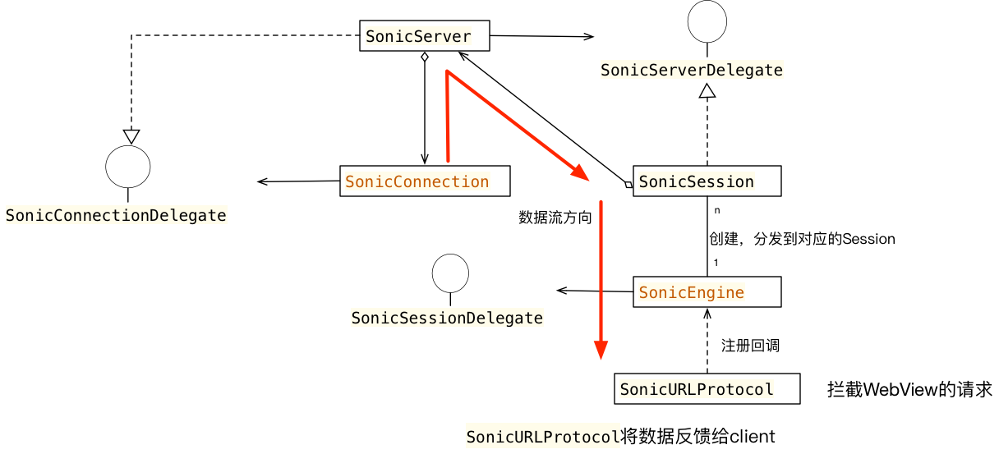

最近在研读Vas Sonic的源码，Sonic是一款轻量级的高性能Hybrid框架，由腾讯QQ会员团队开发，专注于提升H5页面首屏加载速度。

> 首屏就是指用户在没有滚动时候看到的内容渲染完成并且可以交互的时间。至于加载时间，则是整个页面滚动到底部，所有内容加载完毕并可交互的时间。

H5以其开发和维护的成本较低，开发周期较短的天然优势满足了APP快速迭代的需求。目前很多APP或多或少接入了H5页面，但H5存在的缺点是加载速度慢，造成不好的用户体验。因此，如何优化H5的加载速度可以有效提升用户的满意度。

话不多说，接下来我们看看Sonic这个开源库到底是一个什么样的实现原理,首先给大家奉上Sonic的GitHub地址 [点我](https://github.com/Tencent/VasSonic)

看一个开源库，我通常会摸清楚其类层次关系，从整体把握其组件，然后在抽茧剥丝。不然会像走入一个迷宫，有种“只在此山中，云深不知处”的感觉。

下面是我绘制Sonic iOS库的UML类图:



可以梳理出其包含SonicURLProtocol, SonicEngine, SonicSession, SonicSever和SonicConnection五个组件及其相互之间的联系。下面我们从源码中来分析这几个组件的角色和发挥的作用。

1. SonicURLProtocol
   
   看到SonicURLProtocol这个类，我们立刻就能联想到Foundation库的NSURLProtocol类，用户可以通过子类化NSURLProtocol类来对上层的URLRequest请求做拦截，并根据自己的需求场景做定制化响应处理。具体介绍详见[iOS 开发中使用 NSURLProtocol 拦截 HTTP 请求](https://draveness.me/intercept)。SonicURLProtocol利用这个原理来对UIWebView的请求进行拦截，实现自定义页面数据加载和缓存。
   
   SonicURLProtocol有三个重要的方法：
   
   
   ```Objective-C
   + (BOOL)canInitWithRequest:(NSURLRequest *)request
{    
    NSString *value = [request.allHTTPHeaderFields objectForKey:SonicHeaderKeyLoadType];
    if (value.length != 0 && [value isEqualToString:SonicHeaderValueWebviewLoad]) {
        NSString * delegateId = [request.allHTTPHeaderFields objectForKey:SonicHeaderKeyDelegateId];
        if (delegateId.length != 0) {
            NSString * sessionID = sonicSessionID(request.URL.absoluteString);
            SonicSession *session = [[SonicEngine sharedEngine] sessionWithDelegateId:delegateId];
            if (session && [sessionID isEqualToString:session.sessionID]) {
                return YES;
            }
          ...
        }
    }
    return NO;
}
   ```
   
   这个方法重写了NSURLProtocol类的方法，主要过滤需要拦截的请求，只有这个方法返回YES我们才能够继续后续的处理。通过这个方法的实现里面进行请求的过滤，筛选出webView的网络请求进行处理的请求。也就是请求头中含有key值SonicHeaderKeyLoadType对应的值为SonicHeaderValueWebviewLoad的NSURLRequest需要被拦截。
   
   接着会根据请求头中的delegate去SonicEngine中寻找SonicSession,如果找到了对应的SonicSession，接下来会对这个request进行拦截。 那么SonicSession是什么时候被初始化并注册到SonicEngine中的呢？后面我们会进行讲解。
   
   下面我们继续看第2个方法，代码如下：
   
   ```Objective-C
   
   - (void)startLoading 
{    
    NSThread *currentThread = [NSThread currentThread];

    NSString *sessionID = [self.request valueForHTTPHeaderField:SonicHeaderKeySessionID];
    
    __weak typeof(self) weakSelf = self;
    
    [[SonicEngine sharedEngine] registerURLProtocolCallBackWithSessionID:sessionID completion:^(NSDictionary *param) {
        
        [weakSelf performSelector:@selector(callClientActionWithParams:) onThread:currentThread withObject:param waitUntilDone:NO];
        
    }];
}
   ```
 
 这个方法是在请求开始的时候，会被执行。这里做的主要操作是注册了回调，也就是请求结束返回结果后作出对应的操作。核心操作是回调了callClientActionWithParams，也就是我们将要呈现的第三个方法，代码如下：
 
 ```Objective-C
  - (void)callClientActionWithParams:(NSDictionary *)params
{
    SonicURLProtocolAction action = [params[kSonicProtocolAction]integerValue];
    switch (action) {
        case SonicURLProtocolActionRecvResponse:
        {
            NSHTTPURLResponse *resp = params[kSonicProtocolData];
            [self.client URLProtocol:self didReceiveResponse:resp cacheStoragePolicy:NSURLCacheStorageNotAllowed];
        }
            break;
        case SonicURLProtocolActionLoadData:
        {
            NSData *recvData = params[kSonicProtocolData];
            if (recvData.length > 0) {
                [self.client URLProtocol:self didLoadData:recvData];
            }
        }
            break;
        case SonicURLProtocolActionDidSuccess:
        {
            [self.client URLProtocolDidFinishLoading:self];
        }
            break;
        case SonicURLProtocolActionDidFaild:
        {
            NSError *err = params[kSonicProtocolData];
            [self.client URLProtocol:self didFailWithError:err];
        }
            break;
    }
}
  
 ```
 可以看到根据返回的不同的Action作出相应的处理。这里主要是把数据传回请求发起者client（这里就是UIWebView），帮助其正确渲染。
 
 可以看到这个类和我们平时使用一样，主要就是拦截浏览器的请求，然后自定义请求得到数据返回给浏览器，进行渲染。
 
2. SonicURLProtocol
   
   
   
   
   
   
   
   